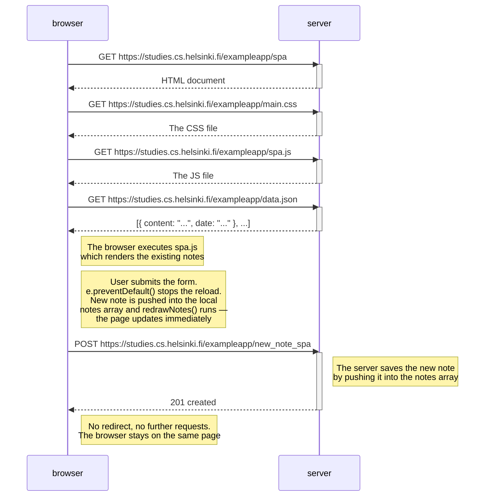

```mermaid
sequenceDiagram
    participant browser
    participant server

    browser->>server: GET https://studies.cs.helsinki.fi/exampleapp/spa
    activate server
    server-->>browser: HTML document
    deactivate server

    browser->>server: GET https://studies.cs.helsinki.fi/exampleapp/main.css
    activate server
    server-->>browser: The CSS file
    deactivate server

    browser->>server: GET https://studies.cs.helsinki.fi/exampleapp/spa.js
    activate server
    server-->>browser: The JS file
    deactivate server

    browser->>server: GET https://studies.cs.helsinki.fi/exampleapp/data.json
    activate server
    server-->>browser: [{ content: "...", date: "..." }, ...]
    deactivate server

    Note right of browser: The browser executes spa.js<br>which renders the existing notes

    Note right of browser: User submits the form.<br>e.preventDefault() stops the reload.<br>New note is pushed into the local<br>notes array and redrawNotes() runs —<br>the page updates immediately

    browser->>server: POST https://studies.cs.helsinki.fi/exampleapp/new_note_spa
    activate server
    Note right of server: The server saves the new note<br>by pushing it into the notes array
    server-->>browser: 201 created
    deactivate server

    Note right of browser: No redirect, no further requests.<br>The browser stays on the same page
```